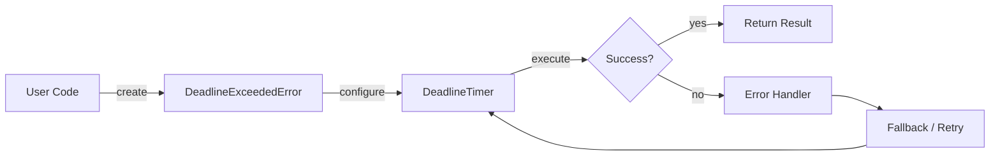
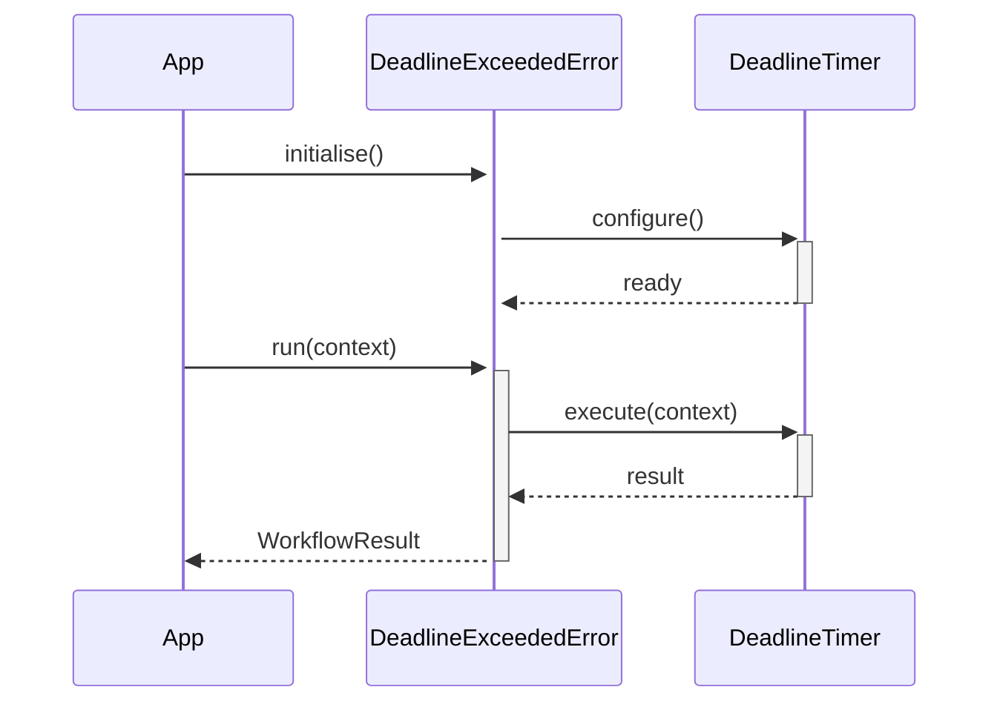

<div align="center">

</div>

# agent-timer

**Execution timing and SLA enforcement for LLM agents. Zero external dependencies.**

[](https://pypi.org/project/agent-timer/) [](https://python.org) [](LICENSE) [](#)

---

## The Problem

Without a timer layer, delayed execution lives in `asyncio.sleep()` calls scattered through business logic — non-cancellable, drift-prone, and invisible to monitoring. Centralised timers are observable, cancellable, and correct.

## Installation

```bash
pip install agent-timer
```

## Quick Start

```python
from agent_timer import DeadlineExceededError, DeadlineTimer, SLAViolationError

# Initialise
instance = DeadlineExceededError(name="my_agent")

# Use
result = instance.run()
print(result)
```

## API Reference

### `DeadlineExceededError`

```python
class DeadlineExceededError(Exception):
    """Raised when a deadline has been exceeded."""
    def __init__(self, deadline_ms: float, elapsed_ms: float) -> None:
```

### `DeadlineTimer`

```python
class DeadlineTimer:
    """
    def __init__(self, deadline_ms: float) -> None:
    def elapsed_ms(self) -> float:
        """Milliseconds elapsed since creation."""
    def remaining_ms(self) -> float:
        """Milliseconds remaining before deadline (may be negative if expired)."""
    def is_expired(self) -> bool:
        """True if the deadline has been exceeded."""
```

### `SLAViolationError`

```python
class SLAViolationError(Exception):
    """Import from sla module — re-exported here for convenience."""
def _get_sla_violation_error():
def _log_json(func_name: str, elapsed_ms: float, extra: dict | None = None) -> None:
def _make_wrapper(
def _handle_result(
```

### `StepNotStartedError`

```python
class StepNotStartedError(Exception):
    """Raised when end_step is called for a step that was never started."""
```


## How It Works

### Flow



### Sequence



## Philosophy

> Kāla — cosmic time — is the great timer; all actions arise and dissolve within its scheduled intervals.

---

*Part of the [arsenal](https://github.com/darshjme/arsenal) — production stack for LLM agents.*

*Built by [Darshankumar Joshi](https://github.com/darshjme), Gujarat, India.*
